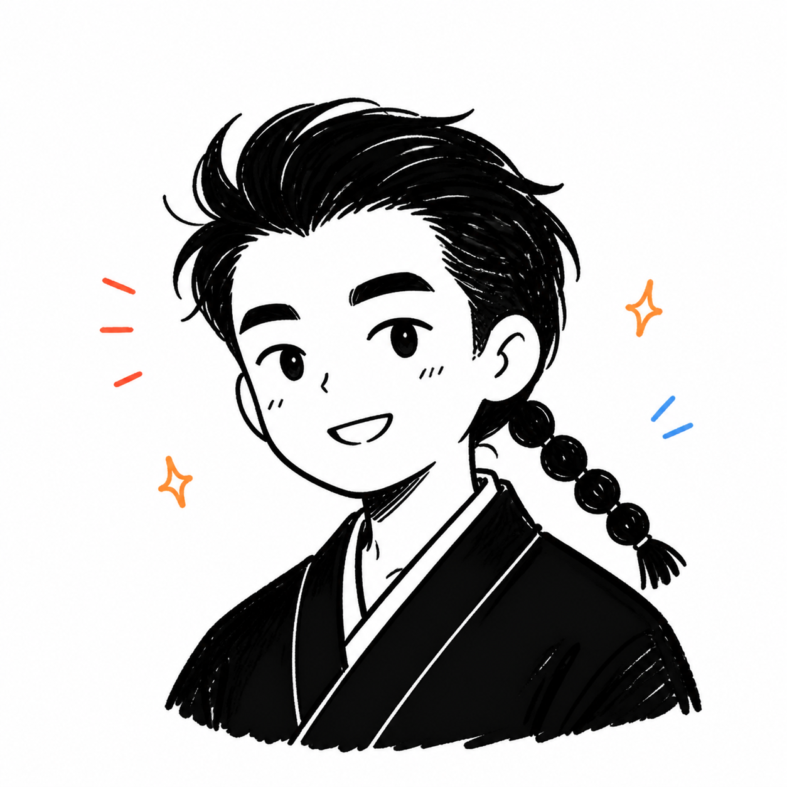
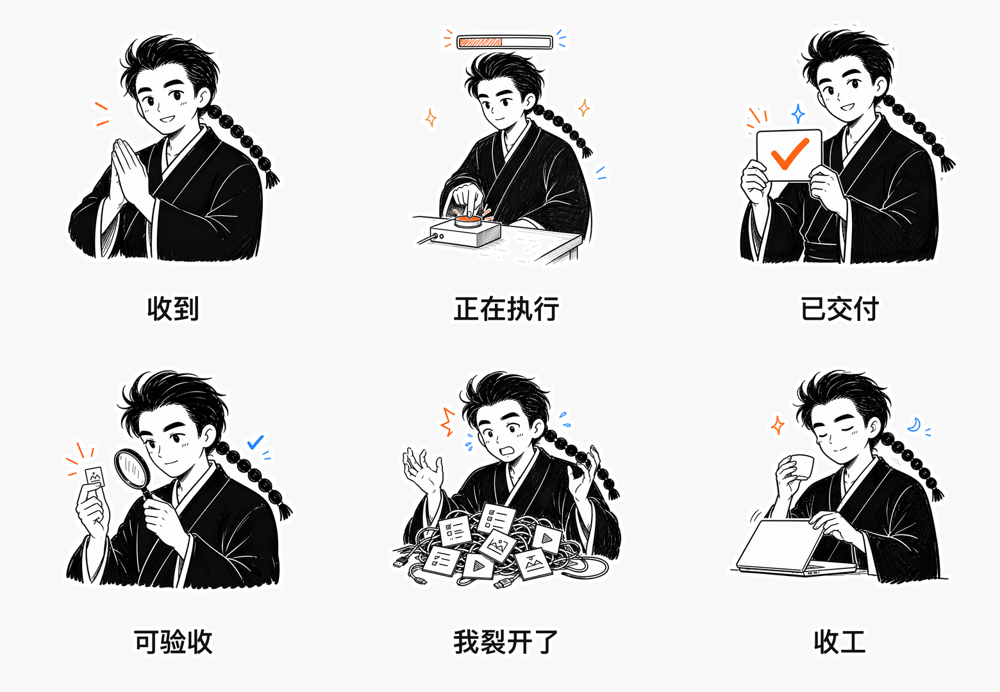
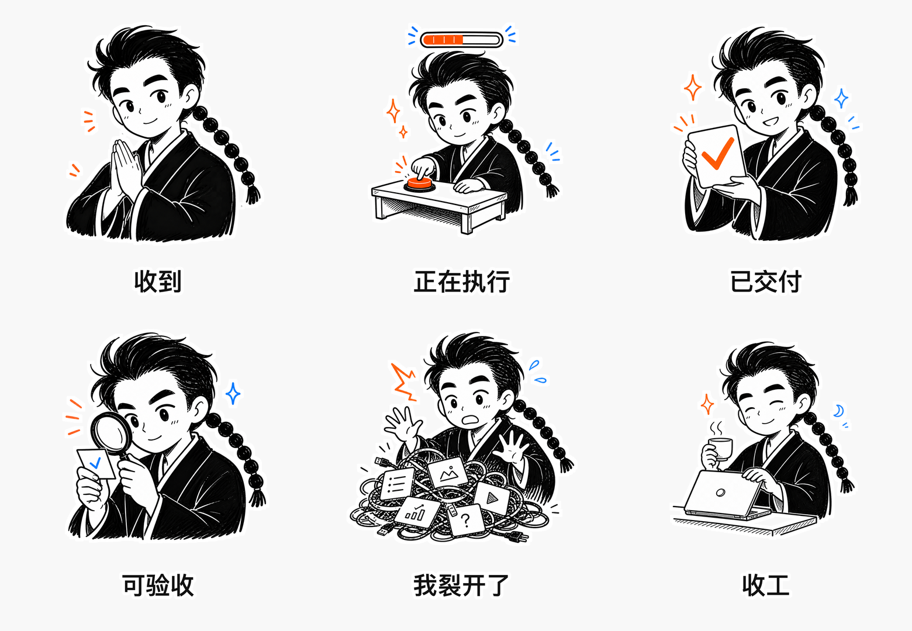

# 示例：用一张头像生成真人版 + Q版表情包

这个示例把一张“辫子哥哥”头像作为普通用户输入，演示通用 Skill 如何自动完成身份提取、双轨规划、单张生成、文字后处理和分文件导出。

## 1. 用户输入

用户只需要提出这句话：

> 用这张头像做一套智能体 IP 表情包，分成真人版和 Q 版，每个表情单独一张，并把文字写上去。

## 2. 自动提取的身份锁定

- 头像与脸型：黑色短发向后梳，清晰的眉眼，亲和、聪明、带一点工作状态的微笑。
- 服装与标志：黑色东方感上衣；长串分节辫子是核心识别点。
- 画面语言：黑白线稿为主，少量橙色和蓝色情绪符号；不做 3D，不做照片写实。
- 允许变化：表情、动作、手势、工作道具和文字。
- 固定约束：不改变发型、辫子和服装识别点；不加入第二个人；不让真人版变成 Q 版，也不让 Q 版退回成人比例。

## 3. 配对意图

| 编号 | 文案 | 真人版动作 | Q版动作 |
|---|---|---|---|
| 01 | 收到 | 双手合十，礼貌回应 | 夸张点头或敬礼 |
| 02 | 正在执行 | 专注操作，带进度条 | 用力按执行按钮 |
| 03 | 已交付 | 举起完成结果 | 开心展示交付卡片 |
| 04 | 可验收 | 放大镜检查结果 | 超大放大镜认真验收 |
| 05 | 我裂开了 | 克制的崩溃感 | 夸张摊在任务堆里 |
| 06 | 收工 | 合上电脑，平静下班 | 轻松喝茶收尾 |

## 4. 输出预览

### 真人版

### Q版

每个预览中的单元都同时对应一个独立 PNG；正式交付时按 `real/`、`q/` 分文件夹，并分别提供 ZIP。

## 5. 这个示例说明了什么

用户不需要理解提示词、尺寸或透明通道。Skill 负责把自然语言请求转成稳定的身份锁定和双轨生产流程；用户只需补充头像、文案、风格或平台要求即可。

本示例中的头像和成品仅用于演示，公开发布前应确认素材持有者授权。
