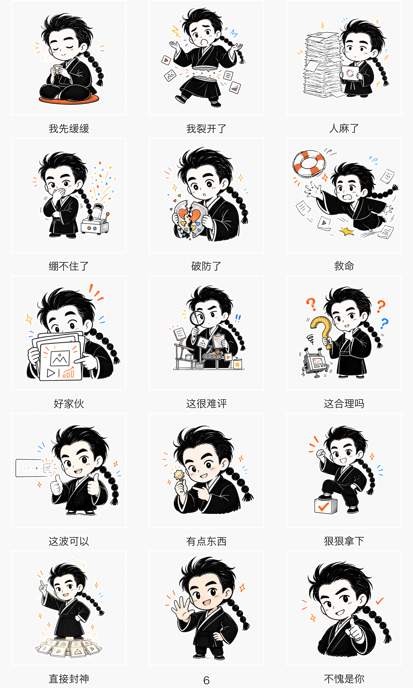
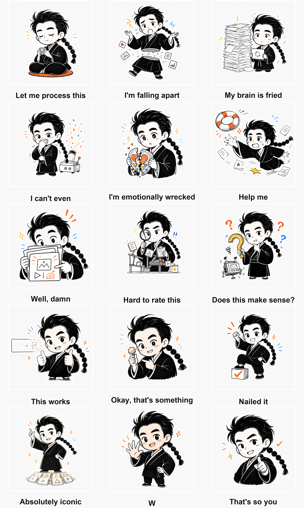
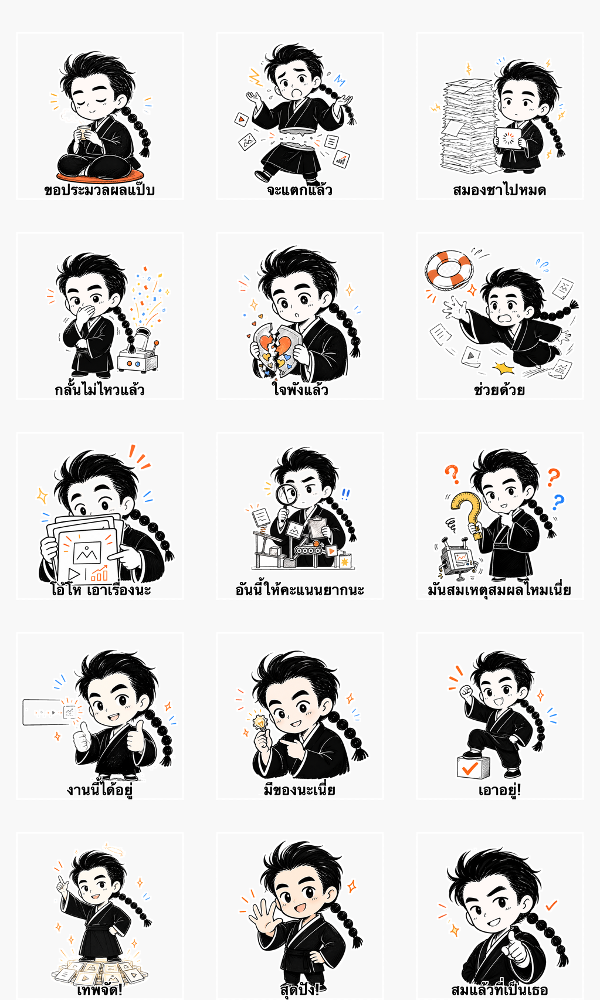

# 示例：辫子哥哥 15 个热梗的中英泰 Q 版表情包

这个示例演示如何用同一套 IP 动作，生成中文、英文和泰语三个语言版本。人物身份、动作、肤色、线稿、透明背景和白色贴纸边保持一致，只替换最终文字。

## 1. 本次配置

- 版本：Q 版
- 数量：15 个热梗
- 输出：中文、英文、泰语
- 画布：1024×1024，统一浅灰实底 PNG
- 文案：后置排版，保证文字可读、可替换
- 肤色标准：接近白色、带轻微暖粉的象牙色，约 `#FFF9F6`
- 背景标准：统一浅灰实底 `#F3F3F3`，不使用纯透明背景

## 2. 15 个文案对照

| # | 中文 | English | ไทย |
|---:|---|---|---|
| 01 | 我先缓缓 | Let me process this | ขอประมวลผลแป๊บ |
| 02 | 我裂开了 | I'm falling apart | จะแตกแล้ว |
| 03 | 人麻了 | My brain is fried | สมองชาไปหมด |
| 04 | 绷不住了 | I can't even | กลั้นไม่ไหวแล้ว |
| 05 | 破防了 | I'm emotionally wrecked | ใจพังแล้ว |
| 06 | 救命 | Help me | ช่วยด้วย |
| 07 | 好家伙 | Well, damn | โอ้โห เอาเรื่องนะ |
| 08 | 这很难评 | Hard to rate this | อันนี้ให้คะแนนยากนะ |
| 09 | 这合理吗 | Does this make sense? | มันสมเหตุสมผลไหมเนี่ย |
| 10 | 这波可以 | This works | งานนี้ได้อยู่ |
| 11 | 有点东西 | Okay, that's something | มีของนะเนี่ย |
| 12 | 狠狠拿下 | Nailed it | เอาอยู่! |
| 13 | 直接封神 | Absolutely iconic | เทพจัด! |
| 14 | 6 | W | สุดปัง! |
| 15 | 不愧是你 | That's so you | สมแล้วที่เป็นเธอ |

## 3. 预览

### 中文

### English

### ไทย

## 4. 独立文件与下载

- [中文 15 张单图](bianzigege-hot-memes/outputs/q/)
- [英文 15 张单图](bianzigege-hot-memes/outputs/en/)
- [泰语 15 张单图](bianzigege-hot-memes/outputs/th/)
- [中文 ZIP](bianzigege-hot-memes/bianzigege-hot-memes-q.zip)
- [English ZIP](bianzigege-hot-memes/bianzigege-hot-memes-en.zip)
- [Thai ZIP](bianzigege-hot-memes/bianzigege-hot-memes-th.zip)

## 5. 一致性规则

- 后梳黑发、浓眉亮眼、黑色衣领和长泡泡辫保持稳定。
- 脸、耳朵、手部和手指统一为接近白色的暖粉象牙色；不混用冷白、灰白、明显粉红或橙黄色肤色。
- 所有成品使用统一浅灰实底 `#F3F3F3`；人物外圈贴纸边、白色衣领、纸张和高光保持纯白。
- 语言变化只发生在文案层，不改变角色身份、动作含义和构图。
- 泰语使用支持组合音标的字体排版，不直接逐字符绘制。

本示例中的头像和成品仅用于演示，公开发布前应确认素材持有者授权。
